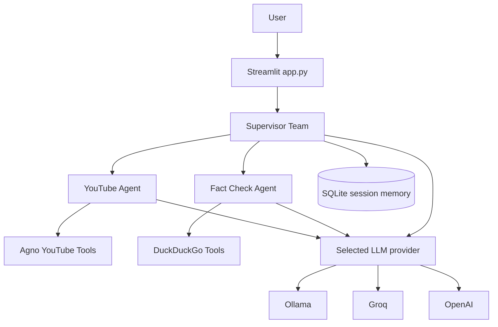

# Multi-Agent AI

An agentic YouTube analysis application built with Streamlit and Agno. The app takes a YouTube URL, analyzes the video, extracts the main claims, and optionally verifies those claims using web search.

## What It Does

- Analyzes YouTube video metadata, structure, topics, and key moments.
- Produces a concise summary with main points and notable factual claims.
- Uses a dedicated fact-checking agent when verification is requested.
- Keeps conversation history so follow-up questions can refer to the same video.
- Supports local Ollama models as well as Groq and OpenAI providers.

## Architecture



## Request Flow

1. The user enters a YouTube URL in the Streamlit interface.
2. The supervisor coordinates the YouTube Agent and asks it to analyze the video.
3. The YouTube Agent uses Agno's YouTube tools to inspect the video and prepare the analysis.
4. The supervisor returns a final response with these sections:
   - `Video Overview`
   - `Summary`
   - `Main Points`
   - `Notable Factual Claims`
5. If the user asks for fact-checking, the supervisor sends up to three claims to the Fact Check Agent.
6. The Fact Check Agent searches DuckDuckGo and classifies each claim as accurate, inaccurate, partially accurate, or unclear.
7. Conversation history is stored in SQLite and reused for follow-up questions.

## Project Structure

```text
Multi-Agent AI/
|-- app.py                  # Streamlit user interface and chat session
|-- model_config.py         # Provider selection and model configuration
|-- supervisor_agent.py     # Team orchestration and response workflow
|-- youtube_agent.py        # YouTube analysis agent and tools
|-- fact_check_agent.py     # Web-based claim verification agent
|-- memory.py               # SQLite database configuration
|-- .env                    # Local provider configuration template
|-- Docs/                   # Screenshots and project documentation assets
`-- README.md
```

## Setup

### 1. Create and activate a virtual environment

```powershell
python -m venv .venv
.\.venv\Scripts\Activate.ps1
```

### 2. Install dependencies

Install the packages used by the application:

```powershell
pip install streamlit agno python-dotenv duckduckgo-search youtube-transcript-api
```

### 3. Configure a provider

The repository includes `.env` as a configuration template. Use one provider at a time.

#### Ollama (local, no API key)

Install Ollama, make sure it is running, and pull a model:

```powershell
ollama pull llama3.2:3b
```

Set:

```env
LLM_PROVIDER=ollama
OLLAMA_MODEL=llama3.2:3b
OLLAMA_HOST=http://localhost:11434
```

#### Groq

```env
LLM_PROVIDER=groq
GROQ_API_KEY=your_groq_api_key
GROQ_MODEL=openai/gpt-oss-20b
```

#### OpenAI

```env
LLM_PROVIDER=openai
OPENAI_API_KEY=your_openai_api_key
OPENAI_MODEL=gpt-4o-mini
```

After changing `.env`, restart Streamlit so the new configuration is loaded.

## Run the App

```powershell
streamlit run app.py
```

Open the local URL shown by Streamlit, paste a YouTube URL, and select **Analyze**. Use the follow-up chat input to ask questions about the analyzed video.

## Provider Selection

All three agents use `build_model()` from `model_config.py`. The active provider is selected through `LLM_PROVIDER`; changing that one value switches the default model for the supervisor, YouTube Agent, and Fact Check Agent.

| Provider | Required setting | API key required |
| --- | --- | --- |
| Ollama | `LLM_PROVIDER=ollama` | No |
| Groq | `LLM_PROVIDER=groq` | Yes |
| OpenAI | `LLM_PROVIDER=openai` | Yes |

## Notes

- Keep API keys local and never commit real secrets.
- The included `.env` is intended as a configuration template; fill in a key only when using Groq or OpenAI.
- Fact-checking requires internet access for DuckDuckGo searches.
- The SQLite memory database is created locally at runtime and is ignored by Git.